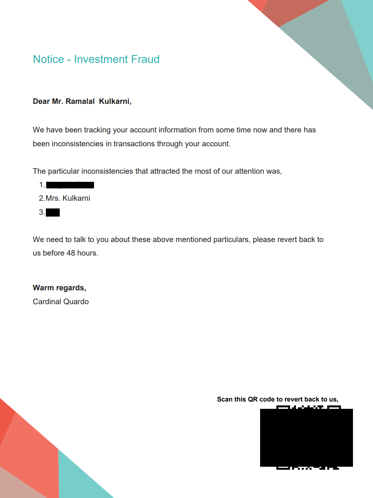
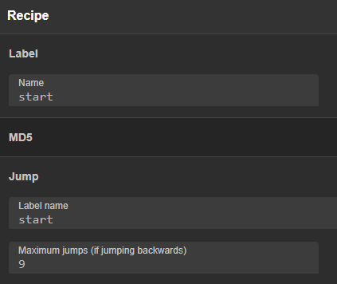

## Are Yaar
### Points: 120
> In a village there were 4 best friends one of them was Ramlal whose favorite dish was 'pulihora'. He was a farmer and with lot of hardwork and passion he became CEO of a Software Organization. https://twitter.com/kulkarniramlal

The Twitter account linked to [a GitHub profile](https://github.com/ramlalkulkarni/), containing a single repo. There's an interesting `Notice - Investment Fraud-pdf.pdf` inside, but it has parts redacted.



Opening in InkScape let us remove the censor bars, revealing the QR code.


It's just a base64 string, decoding gave the flag.

## Bad Api
### Points: 200
> I got dumped here. Help me find my key out.
Look everywhere, including the hidden rooms.
I am waiting for you with a flag in my hand. https://chal.xyz

> Note: An unknown service is running on following `services.xyz:10344`

The site sounds like a password form, so we looked at the service first.

```bash
nmap services.xyz -v -T4 -A -Pn -p 1234

PORT      STATE SERVICE VERSION
10344/tcp open  redis   Redis key-value store
```

It's a Redis server, so we tried connecting with `redis-cli`.

```bash
redis-cli -h services.xyz -p 1234
services.xyz:1234> keys *
1) "ALLYOURBASE"
servicesxyz:1234> get ALLYOURBASE
"AREBELONGTOUS"
```

The password form was HTML with a hidden element, so replaying its POST with `username=AREBELONGTOUS&secret_key=ALLYOURBASE` got the flag.

## NATO
### Points: 200
> A for Apple, B for Ball,can you decipher it faster than all? https://chal.xyz

The challenge site (a password form) linked to a `Clue.zip`, containing an
m4a recording of some NATO alphabet words. They translated to `LZJYOVZBY`. The link text was `619240122`, so caesar-shifting each letter by its corresponding number gives `RASASVADA`. This password got the flag.

## Ninja Injection
### Points: 200
> Injections are to be administered carefully. Although, giving one in a lift is never advised. Until unless, you are a Ninja! https://chal.xyz/

The challenge site seemed blank, but there was a comment in the source.
```html
<!-- Don't forget you are a l33t because of your name only.-->
```

`name` as a querystring parameter returned some form of templated string. So we tried some template injections, and `{{1*1}}` executed successfully. This seemed like a Jinja template based on the challenge name, so with some research we found [an attack to achieve RCE](https://medium.com/@nyomanpradipta120/ssti-in-flask-jinja2-20b068fdaeee). `flag.txt` was in the working directory.

## Hazzy
### Points: 250
> I can see in this pandemic everything is flag{Hazzy_?} https://chal.xyz/chal.gif

The challenge was this gif:


The overlaid numbers were an [A1Z26 cipher](https://gchq.github.io/CyberChef/#recipe=A1Z26_Cipher_Decode('Space')), giving the flag when combined with the hint.

## MD20
### Points: 300
> Nuclear committee is suspicious about their codes getting leaked but 1o1 1o1 they forgot the master password to reset. https://chal.xyz

The challenge site linked to a password checker, and had a hint.
> Hello there ,Does hashing a nuclear code 10 times make it strong ? (I've heard so).But the code is VERY Small in length..I mean really V E R Y short in length.

There's also a broken ``, fixing it to `output.png` gave another hint about the hashed password being a single character.

We moved on to the password checker, which dumped its source.

There was a hash reversal, and a WAF bypass. From the hints, the hash is a single character MD5ed 10 times, so time to bruteforce. `pwntools` will take too long, time to break out CyberChef.



Searching manually, `t` is the matching character. The checker only hashes once, so we need 9th hash `e6dbdd9d770af334d8aebe102b1fc035`.

The checker needs `_` as a querystring parameter, but it's blocked by the WAF with `strpos`. And `%` is blocked too, so no URL-encoding. With some research, we found [this blogpost](https://tipi-hack.github.io/2018/03/25/insomni%27hack-18-phuck.html) - apparently PHP treats `.` in the querystring as `_`. `?.=e6dbdd9d770af334d8aebe102b1fc035` gave the flag.