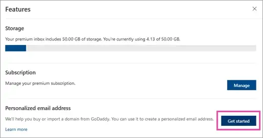

Unlike Microsoft 365 Business, where adding email domains is "just a few clicks away", Microsoft 365 Personal/Family only supports GoDaddy for both registration and DNS. This is a huge red flag to anyone who’s had the misfortune to use GoDaddy, so here’s my workaround.

Credit to this [Reddit comment](https://old.reddit.com/r/Office365/comments/cmk120/use_office365_personal_with_your_own_domain_no/fc5o8k2) for the basis of this writeup, and [DomainConnect’s documentation](https://github.com/Domain-Connect/Templates/blob/master/outlook.com.personalizedoutlookemail.json) for verifying the DNS records.

# Getting Started

Requirements:
1. A Microsoft 365 Personal or Family subscription
2. A domain (tplant.com.au for example)
3. Blessings from Azure (seriously)

Visit [Outlook.com premium settings](https://outlook.live.com/mail/0/options/premium/features) and click Get Started:

This pretty button cost me hours searching for workarounds. If the button doesn’t appear, then Azure has frowned on you - some of the endpoints might be throwing 500s. Don’t waste a month with support like I did, apparently it’s a known issue. Try again tomorrow?

If you lucked out, the button should open a URL like this: https://domainconnect.godaddy.com/v2/domainTemplates/providers/outlook.com/services/personalizedoutlookemail/apply?mxRecordValue=XXXXXXXXX

Copy the mxRecordValue (9–10 digits), we don’t need any other query parameters.

# DNS Trickery

Now for DNS, we're going to impersonate GoDaddy. Add the following records to your provider:

Fill XXXXXXXXX with your mxRecordValue, and give your DNS time to propagate. DMARC and DKIM are officially unsupported, and I'm not brave enough to test MTA-STS on my main account...

Now, visit the old Outlook.com window, choose “I have a GoDaddy Account”, and provide your domain. Congratulations, you can now use a single custom email alias! Or multiple for M365 Home, but only 1 per user.

# Aliases

Microsoft warn against setting your email alias as your primary account alias (displays in Office apps etc), and it's even grayed out in settings. But good old Inspect Element comes to the rescue.

Visit the [account aliases page](https://account.live.com/names/Manage), and remove the `disabled` HTML attribute from the "Make primary" button for your custom alias. Clicking it should now work, and I'm yet to find any major issues, although Microsoft support get a bit confused.

# 2022 Update
My custom mail and account alias is still going strong, but I received a deprecation notice on November 8:

> Starting November 30, 2023, you will no longer be able to associate a new personalized email address (e.g. yourname@example.com) with your Outlook.com mailbox. If you already have a personalized email address set up, you will not be impacted by this change, and you can continue using it without any disruption in service. After November 30, 2023, if you choose to remove your existing personalized email address, you will be unable to add it back.

They'll probably kill the feature entirely in a few years. I've had a good run, but this setup was pretty janky anyway. Stay tuned for a post on my eventual migration to Protonmail.
