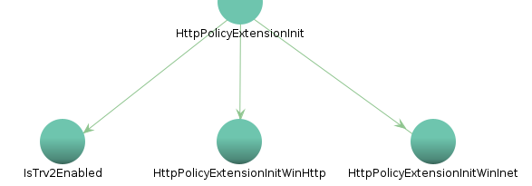
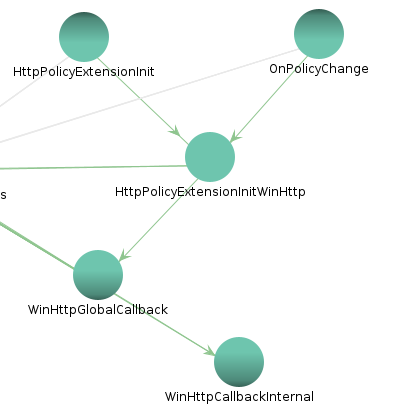
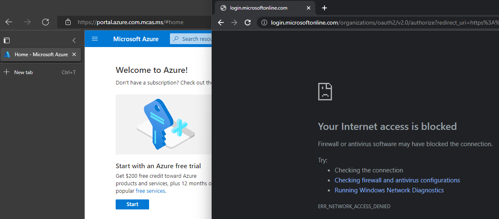

For background info on tenant restrictions, check out my [previous post](https://tplant.com.au/blog/tenant-restrictions-v2/part-1/).

## Cloud Identity Service

Taking a look in Event Viewer, there's a new log Microsoft-Windows-TenantRestrictions/Operational with some events:

> 1004: The endpoint sync service (cloudidsvc) started succesfully \[sic\].
> 
> 1005: The endpoint sync service (cloudidsvc) succesfully \[sic\] synced the latest list of endpoints.

That service has an interesting description:

>Supports integrations with Microsoft cloud identity services.  If disabled, tenant restrictions will not be enforced properly.

The service is implemented in `System32\cloudidsvc.dll`, and determines which hosts should receive the TRv2 headers if TRv2 is configured. It discovers hostnames via the [Office 365 IP Address and URL web service](https://learn.microsoft.com/en-us/microsoft-365/enterprise/microsoft-365-ip-web-service), then adds a built-in list (below) and any GPO-defined hostnames or IPs.
* login.live.com
* login.microsoft.com
* login.microsoftonline.com
* login.windows.net
* login.microsoftonline.us
* login.microsoftonline.de
* login.chinacloudapi.cn
* \*.live.com
* \*.microsoft.com
* \*.office.com

It also registers a [WNF](https://blog.quarkslab.com/playing-with-the-windows-notification-facility-wnf.html) subscription to system Group Policy updates (`WNF_GPOL_SYSTEM_CHANGES`), to update the host list if the TRv2 policy changes.

## Tenant Restrictions Plugin

`cloudidsvc` doesn't actually inject the `Sec-Restrict-Tenant-Access-Policy` header though. On a hunch, I had a quick look in `System32` for any interesting files. Surprisingly there's a new `TenantRestrictionsPlugin.dll` - maybe this will have more details.

This time it's a [`DllMain`](https://learn.microsoft.com/en-us/troubleshoot/developer/visualstudio/cpp/libraries/use-c-run-time#section-2-using-the-crt-libraries-when-building-a-dll) library. It has some references to WinHTTP plugin state though, and some interesting exports: `GetTenantRestrictionsHostnames`, `HttpPolicyExtensionInit`, and `HttpPolicyExtensionShutdown`. `GetTenantRestrictionsHostnames` is pretty self explanatory, it just loads hostnames from `cloudidsvc`'s cache in the registry.

`HttpPolicyExtensionInit` might be related to the header injection we observed previously. It starts by checking if `cloudidsvc` is running and starting it if needed, then calls `HttpPolicyExtensionInitWinHttp` or `HttpPolicyExtensionInitWinInet` depending on a flag argument. It also sets up a `PluginStateManager`, that will rerun these init functions later via an `OnPolicyChange` event handler. 

The init functions are the real core of TRv2. We'll start with `HttpPolicyExtensionInitWinHttp` which sets the `0xa3` [WinHTTP option](https://learn.microsoft.com/en-us/windows/win32/winhttp/option-flags) and registers a `WinHttpGlobalCallback` function. This appears to intercept WinHTTP requests for modification, but the only documentation I could find was an `ERROR_WINHTTP_GLOBAL_CALLBACK_FAILED` definition in `winhttp.h`. Such an API could be extremely powerful, and [`WinHttpSetOption`](https://learn.microsoft.com/en-us/windows/win32/api/winhttp/nf-winhttp-winhttpsetoption) has been [used by malware](https://blog.talosintelligence.com/tinyturla/), so I tried to call it in a test C++ binary.

Unfortunately `dwBufferLength=sizeof(&callback)` of resulted in `ERROR_INSUFFICIENT_BUFFER`. After some trial and error, `dwBufferLength=40` induced a delay of several seconds, then an NT `STATUS_ACCESS_VIOLATION`. Any larger buffers would result in the same `ERROR_INSUFFICIENT_BUFFER`, so I'm really not sure of the root cause here. Given this was my first time writing C++, I hope someone more knowledgable can research this avenue further.

Digging deeper into `WinHttpGlobalCallback` confirms my suspicions. It's responsible for setting `Sec-Restrict-Tenant-Access-Policy`, and `HttpPolicyExtensionInitWinInet` implements a similar feature for `WinINet` requests via another undocumented `0xbc` [WinINet option](https://learn.microsoft.com/en-us/windows/win32/wininet/option-flags). There's also an `ERROR_INTERNET_GLOBAL_CALLBACK_FAILED` definition in `wininet.h`. Testing it via C++ didn't fare much better than WinHTTP, exhibiting the same strange NT buffer behaviour. I also tried running as SYSTEM or other services via PsExec, and using a sandbox to avoid antivirus issues, but with no success.

The final export is `HttpPolicyExtensionShutdown`, which has a similar WinHTTP and WinINet code flow for clearing their respective callbacks.

## WDAC and Windows Firewall

So far, we've discovered how the M365 hosts are determined, and how the header is injected to enforce a tenant's restriction policy. But there's one last feature that's missing - "Enable firewall protection of Microsoft endpoints". The group policy description mentioned a WDAC policy, tagging, and Windows Firewall.

I was immediately suspicious of [WDAC AppId tagging](https://learn.microsoft.com/en-us/windows/security/threat-protection/windows-defender-application-control/appidtagging/windows-defender-application-control-appid-tagging-guide), a special type of WDAC policy for tagging processes with a configurable ID. Implementation docs were released a few months ago, but without any actual usecases. Fortunately the [debugging doc](https://learn.microsoft.com/en-us/windows/security/threat-protection/windows-defender-application-control/appidtagging/debugging-operational-guide-appid-tagging-policies) provides an example tag `POLICYAPPID://MyKey`, so we at least have a prefix to search for. 

Sure enough, `System32\mpssvc.dll` contains this one-liner: `O:SYG:SYD:(XA;;0x1;;;WD;(Exists POLICYAPPID://M365ResourceAccessEnforcement))`. Static analysis shows it's used in `FwTenantRestrictionsPolicyRefresh`, and in fact there's a whole series of `FwTenantRestrictions*` functions:
* AddCoreNetworkingAllowRules
* AddRule
* CompareSubnetHlpr
* Initialize

`AddCoreNetworkingAllowRules` implements a set of firewall rules to allow core protocols (eg DHCP, ICMP) and non-M365 traffic. But the most interesting rule uses `AddRule` to block traffic to M365 endpoints, unless the source process has the `M365ResourceAccessEnforcement` WDAC tag. This could be pretty useful to mitigate unapproved apps or app consent phishing, especially if complete application control isn't feasible (WDAC/AppLocker). I did a quick demo with an approved corporate browser (Edge) alongside an unapproved browser (Chrome):

That's all I have for this feature, I hope you enjoyed.